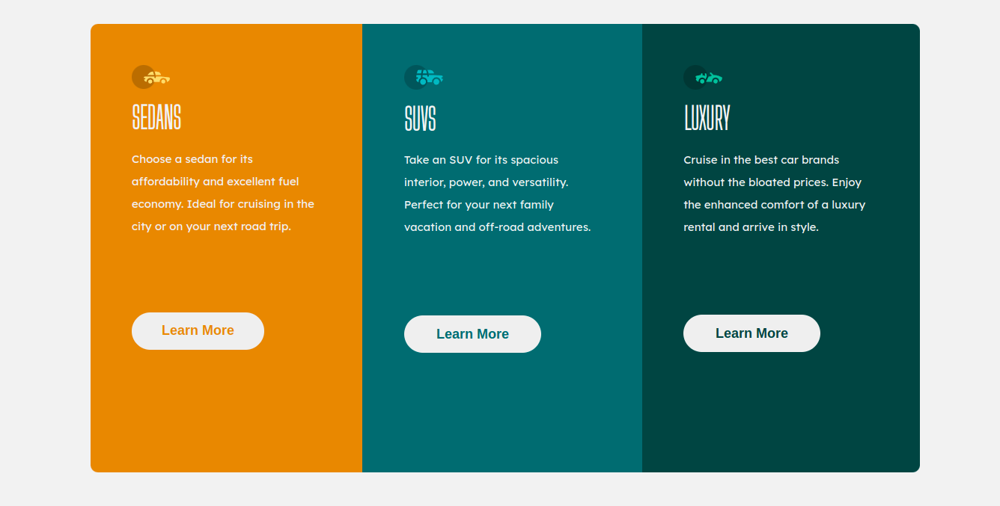

# Cards
Front end mentor task to make 3 cards using HTML and CSS

## Layout

The designs were created to the following widths:

- Mobile: 375px
- Desktop: 1440px

## Built With

- HTML
- CSS

## Live Demo

[Live Demo Link](https://hanningtonem.github.io/Cards/)

## Getting Started

To get a local copy up and running:

1. Clone this repository or download the Zip folder:

**``git clone https://github.com/HanningtoneM/Cards.git``**

2. Navigate to the location of the folder in your machine:

**``you@your-Pc-name:~$ cd <folder>``**

## Author

👤 **hanningtone Monda**

- Github: [@HanningtoneM](https://github.com/HanningtoneM)
- linkedin: [@Hanningtone Machuka](https://www.linkedin.com/in/hanningtone-machuka-58501722a)
- Twitter: [@Hanningtone254](https://twitter.com/Hanningtone254?t=YVXXz9EZzOhR5vPi3DlHDQ&s=09)

## Credits
Template from this [Frontend Mentor](https://www.frontendmentor.io)

## Contributers

## Show your support

Give a ⭐️ if you like this project and how we manage to build it!